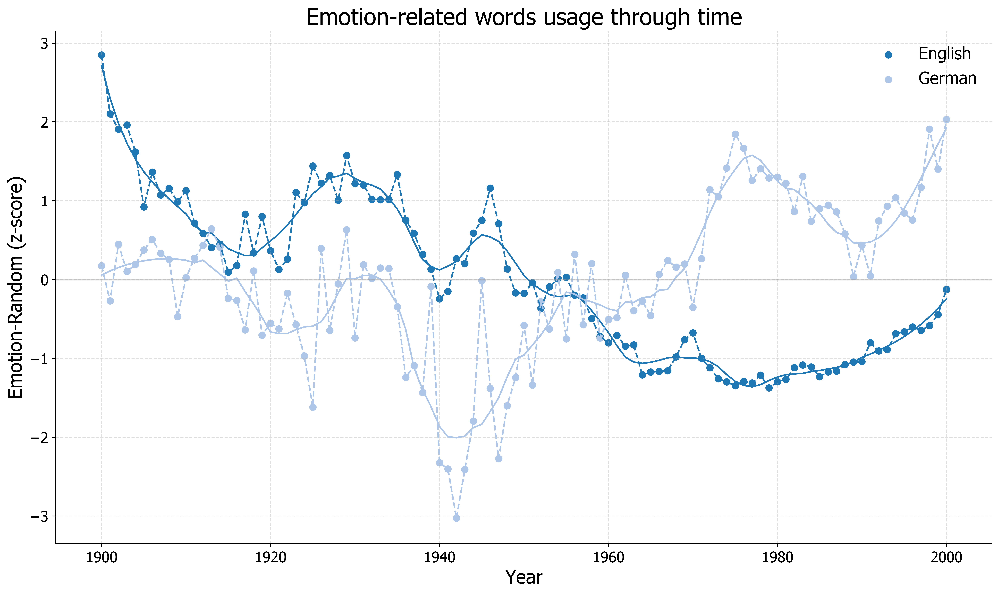

# EmotionsInLiterature

Here I analyze the emotional content in 20th century's English and German literature. I am crawling and processing more than 20GB of Google 1-grams. 

## Implementation
`translation.py`, extracts the WordNetAffect list of emotion-related words in English and translates them in German.

`process.py`, crawls Google's API to get English and German 1-grams and maps their emotional content based on the dictionaries extracted from WordNetAffect. The script is written with functional programming principles in mind, so it does not burden the machine's memory. Each 1-gram record is processed on the fly without loading entire datasets in memory.

`analysis.ipynb`, calculates z-scores on the processed data and visualizes the output.

## Evolution of emotional word use over time

For more information and discussion on the results please refer to [this blog post](http://sokratispapadopoulos.com/journal/literature-emotions.html)

